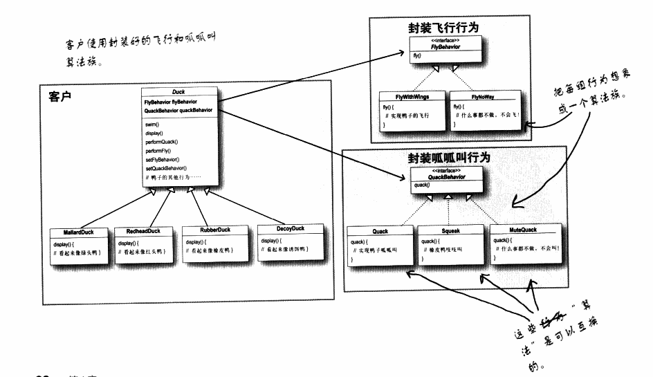

策略模式：

将鸭子类中的可变部分 行为（叫和飞）抽象出来，成为抽象的行为类：

FlyBehavior

QuackBehavior

Duck的抽象类 和 行为类为 关联关系，使用箭头表示，代码中以成员变量的形式实现

一个普通的鸭子类， 继承与duck, FlyBehavior,QuackBehavior 的实例化放在MallarDuck的构造函数中实现；

这样 如果新增需求吃，不同的鸭子有吃或者不吃，duck类中新增一个成员变量， 需要增加吃的，在构造函数中 实例化相应的吃子类， 不需要增加吃的，在狗仔函数中实例化相应的不吃子类；

初始化实例变量 不够弹性；在duck中新增SetFlyBehavior(FlyBehavior *fb)和SetQuackBehavior(QuackBehavior *qb), 这样可以在运行中多态的改变鸭子的行为；

策略模式 定义了算法簇，分别封装起来，让他们可以相互替换，此模式让算法的变化独立于使用算法的客户

### 这章学到的三个设计原则

1. 开闭原则：面向扩展开放，面向修改关闭
2. 多用组合，少用继承
3. 针对接口编程，而不是针对实现编程： 主要是使用父类（抽象基类）声明对象，使用子类实例化对象；

