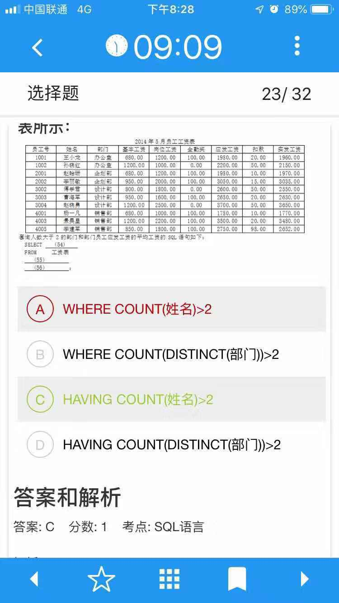

### 数据库关系模式
讲解：
https://www.cnblogs.com/scarecrow-ryan/p/9204821.html

范式（Normal form）就是通过不同种类的函数依赖，属性约束等构建起的规则，数据库结构的设计必须要满足这些规则，才具备范式的属性；

1NF Normal form  第一范式：所有属性不可分
若关系模式R（U）中关系的每个分量都是不可分的数据项（值，原子），则称R（U）属于第一范式

### SQL：
AVG(列) 求平均数  某一个值AS变量 将某个值放在这个变量里进行记录
MAX(列) 求该列的最大值  MIN(列) 求该列的最小值

SELECT 零件号，零件名称，AVG(库存量)AS平均库存量， MAX(库存量)-MIN(库存量)AS差值 form p GROUP BY 零件号

VIEW ，with check option

VIEW 是一个虚拟表，查询时可以从一个或者多个基本表或者视图中导出；

在数据库系统中，当视图创建完毕后，数据字典中存放的是视图定义。视图是从一个或者多个表或视图中导出的表，其结构和数据是建立在对应表的査询基础上的。和真实的表一样，视图也包括几个被定义的数据列和多个数据行，但从本质上讲，这些数据列和数据行来源于其所引用的表。因此，视图不是真实存在的基础表，而是一个虚拟表， 视图所对应的数据并不实际地以视图结构存储在数据库中，而是存储在视图所引用的基本表中。

因为WHERE语句是对表进行条件限定，所以选项A和B均是错误的。在GROUP BY子句后面跟一个HAVING子句可以对元组在分组前按照某种方式加上限制。COUNT (*)是某个关系中所有元组数目之和，但COUNT (A)却是A属性非空的元组个数之和。COUNT(DISTINCT(部门))的含义是对部门属性值相同的只统计1次。HAVING COUNT(DISTINCT(部门))语句分类统计的结果均为1，故选项D是错误的；HAVING COUNT(姓名)语句是分类统计各部门员工，故正确的答案为选项C
