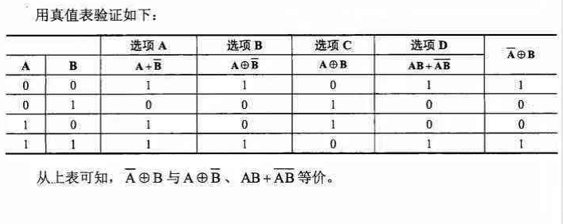

### HTML

基本标签的使用

1. 对于超链接，`<alink>`用于设置正在被击中的链接的颜色。 `<vlink>`用于设置已使用的链接的颜色。`<background>`用于设置背景图片的URL。`<bgcolor>`用于设置文档整体背景颜色

2. tr标记的使用。`<tr>`标记用于定义表格中的一行。`<col>`标记用于定义表格中一个或多个列的属性值。`<td>`标记用于定义表格中的一个单元格。 `<title>`标记用于定义文档标题.

3. 指向电子邮箱的超链接 `<a>`	定义一个超级链接,注意下面的mailto
```
<p>
这是一个电子邮件链接：
<a href="mailto:someone@example.com?Subject=Hello%20again" target="_top">
发送邮件</a>
</p>
```
4. `<table>` 标记的align 属性用来定义对齐方式
5. 如果一个语言的数据具有类型，他的作用 **不包含** 定义和应用动态数据结构；
6. 


### 易错题:

1. $\overline{\mathrm{A}} \oplus \mathrm{B}$ 的等价表达式




