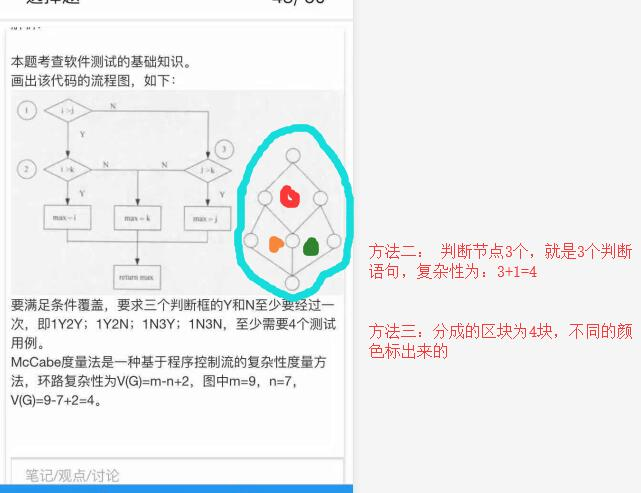
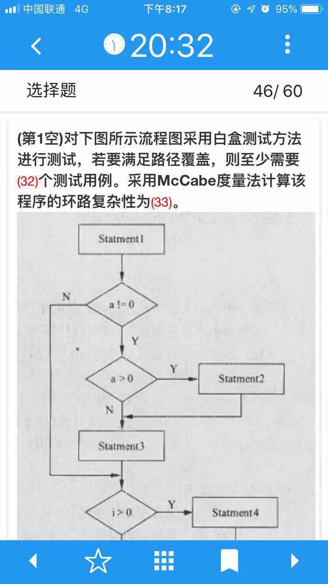
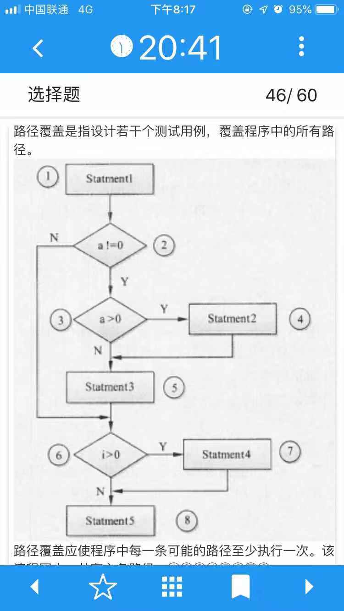
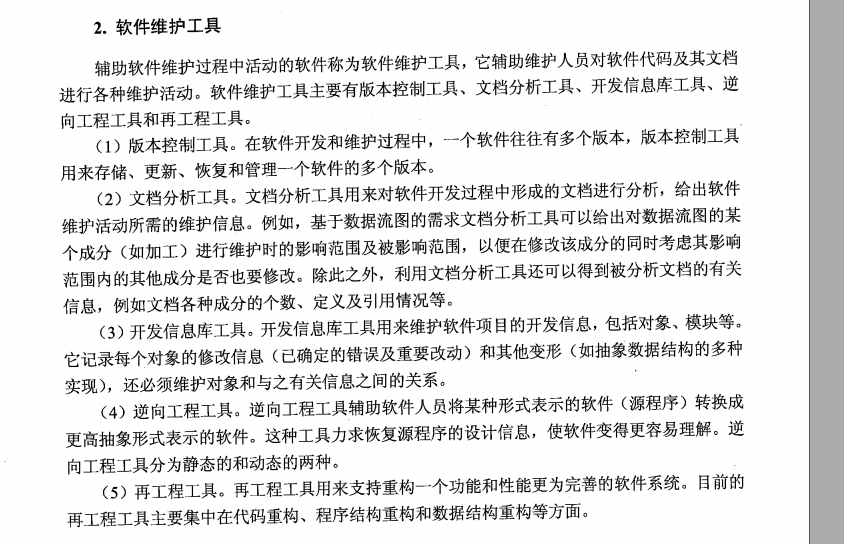

### 测试

**白盒测试**也称为结构测试，根据程序的内部结构和逻辑来设计测试用例，对程序的路径和过程进行测试，检查是否满足设计的需要。其常用的技术有**逻辑覆盖**、**循环覆盖** 和**基本路径测试**。
1. **逻辑覆盖**
1.1 **语句覆盖**是指选择足够的测试数据使被测试程序中每条语句至少执行一次。
1.2 **判定覆盖(又称为判定覆盖)**是指选择足够的测试数据使被测试程序中每个判定表达式至少获得一次“真”值和“假”值。
1.3 **条件覆盖是指构造一组测试用例，使得每一判定语句中每个逻辑条件的各种可能的值至少满足一次**。
1.4 **路径覆盖**是指覆盖被测程序中所有可能的路径。路径覆盖的例子， 要求将程序中所有的路径都走一遍，判断语句跳过的路径少一些，也算不同的路径。具体看下面的例子，几条路径就至少几条测试用例。

**软件测试的基本目标是为了发现软件中的错误**，但软件测试分为几个不同的阶段，每个阶段的侧重点是有所不同的。**单元测试**主要是**发现程序代码中的问题，针对详细设计和软件实现阶段的工作进行的**；**集成测试**验证系统模块是否能够根据系统和程序设计规格说明的描述进行工作，即模块以及模块之间的接口的测试：而**系统测试**则是**验证系统是否确实执行需求规格说明中描述的功能和非功能要求，因此测试目标在需求分析阶段就已经定义**。

**单元测试**也称为模块测试，在模块编写完成且无编译错误后就可以进行。单元测试侧重于模块中的内部处理逻辑和数据结构。单元测试主要检查模块的以下**5个特征**：**模块接口、局部数据结构、重要的执行路径、出错处理和边界条件**。
①模块接口。模块的接口保证了测试模块的数据流可以正确地流入、流出。在测试中应检査以下要点：
•测试模块的输入参数和形式参数在个数、属性、单位上是否一致。
•调用其他模块时所给出的实际参数和被调用模块的形式参数在个数、属性、单位上是否一致。
•调用标准函数时所用的参数在属性、数目和顺序上是否正确。
•全局变量在各模块中的定义和用法是否一致。
•输入是否仅改变了形式参数。
•开/关的语句是否正确。
•规定的I/O格式是否与输入输出语句一致。
•在使用文件之前是否已经打开文件或是用文件之后是否己经关闭文件。
②局部数据结构。在单元测试中，局部数据结构出错是比较常见的错误，在测试时应重点考虑以下因素：
•变量的说明是否合适。
•是否使用了尚未赋值或尚未初始化的变量。
•变量的初始值或默认值是否正确。
•变量名是否有错(例如：拼写错误)。
③重要的执行路径。在单元测试中，对路径的测试是最基本的任务。由于不能进行穷举测试，需要精心设计测试例子来发现是否有计算、比较或控制流等方面的错误。
•计算方面的错误：算术运算的优先次序不正确或理解错误；精度不够；运算对象的类型彼此不相容；算法错误；表达式的符号表示不正确等。
•比较和控制流的错误：本应相等的量由于精度造成不相等；不同类型进行比较； 逻辑运算符不正确或优先次序错误；循环终止不正确(如多循环一次或少循环一 次)、死循环；不恰当地修改循环变量；当遇到分支循环时，出口错误等。
④出错处理。好的设计应该能预测到出错的条件并且有对出错处理的路径。虽然计算机可以显示出错信息的内容，但仍需要程序员对出错进行处理，保证其逻辑的正确性，以便于用户维护。
⑤边界条件。边界条件的测试是单元测试的最后工作，也是非常重要的工作。软件容易在边界出现错误。

**单元测试不需要考虑： 输入参数是否使用了尚未赋值或者尚未初始化的变量**

**集成测试**把模块按系统设计说明书的要求组合起来进行测试。**存在多种组合的集成测试策略：自底向上、自顶向下、一次性集成、三明治集成等**。
**自底向上策略**通过不断合并底层模块来测试更高层模块的方式进行。在该方法中，需要写驱动程序来调用待测试的底层模块，**主要的设计问题需要到测试后期才能发现**。由于**从最底层的模块开始测试，因此过程中不需要写桩模块**。当测试过程中发现错误时，需要进行回归测试。

**三明治集成**：结合自底向上和自顶向下两种测试策略，该测量的优势是结合了自底向上和自顶向下的优点，**如较早地验证了主要的控制构件和底层模块，并行测试程度较高**等。但**缺点是需要写较多的驱动模块和桩模块。**

**McCabe(环形复杂度定量度量程序)**的逻辑复杂度。描绘程序控制流的流图之后，可以用下述3种方法中的任何一种来计算环形复杂度。（1）流图中的区域数等于环形复杂度。（2）流图G的环形复杂度V(G)=E-N+2，其中，E是流图中边的条数，N是结点数。（3）流图G的环形复杂度V(G)=P+1，其中，P是流图中判定结点的数目。

例子：

路径覆盖应使程序中每一条可能的路径至少执行一次。该流程图中一共有六条路径：①②③④⑤⑥⑦⑧，①②③④⑤⑥⑧，①②③⑤⑥⑦⑧，①②③⑤⑥⑧，①②⑥⑦⑧，①②⑥⑧，因此，实现路径覆盖至步需要6个测试用例。

注意标语句序号，需要把判断语句也标进去

### 软件维护
**软件维护**主要是指根据需求变化或硬件环境的变化对应用程序进行部分或全部的修改。修改时应充分利用源程序，修改后要填写程序修改登记表，并在程序变更通知书上写明新老程序的不同之处。
软件维护的内容一般有以下几个方面：
**①正确性维护**，是指改正在系统开发阶段己发生而系统测试阶段尚未发现的错误。这方面的维护工作量要占整个维护工作量的17%-21%。所发现的错误有的不太重要，不影响系统的正常运行，其维护工作可随时进行；而有的错误非常重要，甚至影响整个系统的止常运行，其维护工作必须制定计划，进行修改，并且要进行复查和控制。
**②适应性维护**，是指**使应用软件适应信息技术变化和管理需求变化而进行的修改**。这方面的维护工作量占整个维护工作量的18%-25%。由于目前计算机硬件价格的不断下降，各类系统软件层出不穷，人们常常为改善系统硬件环境和运行环境而产生系统更新换代的需求；企业的外部市场环境和管理需求的不断变化也使得各级管理人员不断提出新的信息需求。这些因素都将导致适应性维护工作的产生。进行这方面的维护工作也要像系统开发一样，有计划、有步骤地进行。
**③完善性维护**，这是为扩充功能和改善性能而进行的修改，主要是**指对已有的软件系统增加一些在系统分析和设计阶段中没有规定的功能与性能特征**。这些功能对完善系统功能是非常必要的。另外还包括对处理效率和编写程序的改进，这方面的维护占整个维护工作的50%-60%，比重较大，也是关系到系统开发质量的重要方面。这方面的维护除了要有计划、有步骤地完成外，还要注意将相关的文档资料加入到前面相应的文档中去。
**④预防性维护**，为了改进应用软件的可靠性和可维护性，以及适应未来的软硬件环境的变化，应主动增加预防性的新的功能，以使应用系统适应各类变化而不被淘汰。比如将专用报表功能改成通用报表生成功能，以适应将来报表格式的变化。这方面的维护工作量占整个维护工作量的4%左右

**逆向工程**从详细的源代码实现中抽取抽象规格说明，一般来说是在原软件交付用户使用之后进行的**，即在原软件的维护阶段进行**。

**辅助软件维护过程中的活动的软件称为“软件维护工具”**，它辅助维护人员对软件代码及其文档进行各种维护活动。软件维护工具主要有：1、版本控制工具；2、文档分析工具；3、开发信息库工具；、4、逆向工程工具；5、再工程工具；

