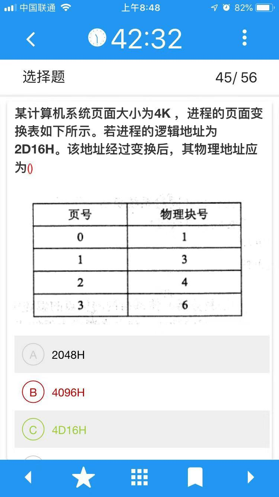
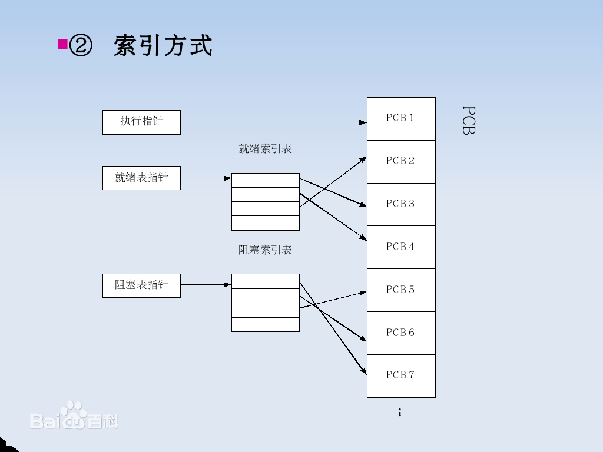

PV操作是典型的同步机制之一。用一个信号量与一个消息联系起来，当信号量的值为0时，表示期望的消息尚未产生；当信号量的值非0时，表示期望的消息已经存在。**用PV操作实现进程同步时，调用P操作测试消息是否到达，调用V操作发送消息。**

在操作系统中，信号量S是一整数。S大于或等于零，代表可供并发进程使用的资源实体数；在S小于零时，$|S|$表示正在等待使用资源实体的进程数。建立一个信号量必须说明此信号量所代表的意义并且赋初值。除赋初值外，信号量仅能通过PV操作来访问。

### 资源分配图化简法：
https://blog.csdn.net/coding1994/article/details/52474731

在同一进程中的各个线程都可以共享该进程所拥有的资源，如访问进程地址空间中的每一个虚地址；访问进程所拥有的已打开文件、定时器、信号量机构等，但是不能共享进程中某线程的栈指针。

至少有多少个资源，系统不发生死锁？

例： 某系统中有3个并发进程竞争资源R，每个进程都需要5个R， 那么至少有几个R，才能保证系统不会发生死锁。

分析：首先给每个进程分配所需资源数减1个资源，然后系统还有1个资源，则不可能发生死锁。即：3*4+1=13

计算逻辑地址：

2D16=0010 1101 0001 0110

4K= 2^12， 0010 等于2，所以2D16 处在第2页上，对应的物理块是4，即4D16H；

进程控制块组织方式：

1）线性表方式：不论进程的状态如何，将所有的PCB连续地存放在内存的系统区。这种方式适用于系统中进程数目不多的情况。
2）索引表方式：该方式是线性表方式的改进，系统按照进程的状态分别建立就绪索引表、阻塞索引表等。

3）链接表方式：系统按照进程的状态将进程的PCB组成队列，从而形成就绪队列、阻塞队列、运行队列等。

